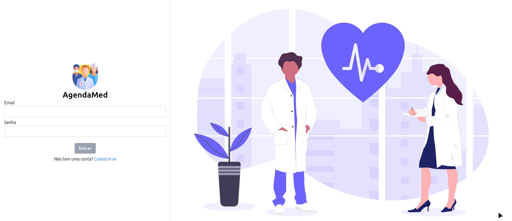
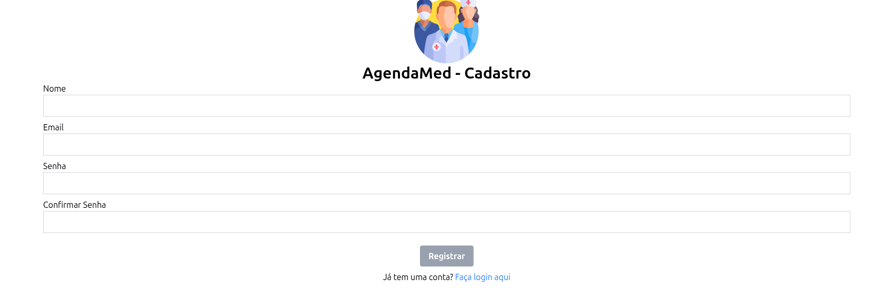
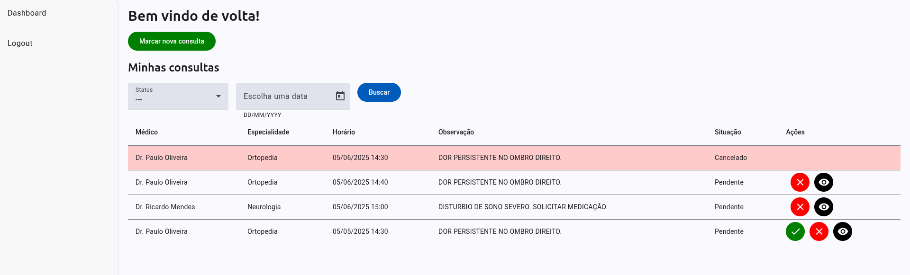
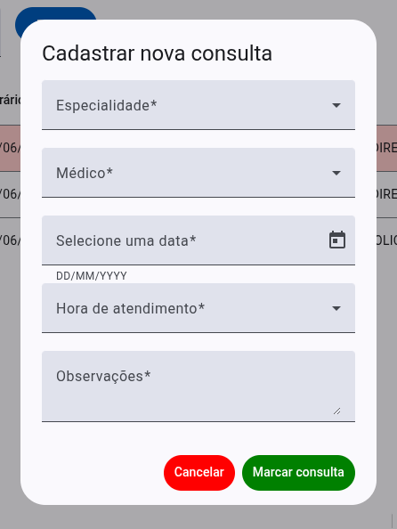
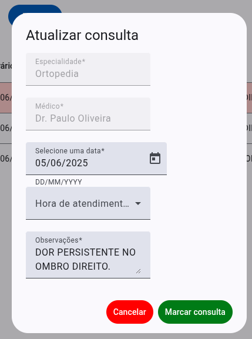

# AgendaMed



O AgendaMed é um sistema de agendamento de consultas médicas com uma interface limpa e agradável.

## Sumário
1. Como rodar o projeto
2. Rotas da API

## Como rodar o projeto
Antes de tudo, é importante que você tenha o Angular e o NestJS instalado em sua máquina:

Angular: `npm install -g @angular/cli`
NestJS: `npm i -g @nestjs/cli`

Teremos 3 serviços (ou camadas): front, api e banco de dados. 

> **Alterações que precisam ser feitas:** criação de arquivo `.env` dentro do projeto da API. Já tem um .env.example para se basear

A API terá o arquivo `.env` no formato:

``` env
DATABASE_URL="sqlserver://HOST:PORT;database=DATABASE;user=sa;password=PASSWORD;trustServerCertificate=true;encrypt=true"
```

O `.env` será importante para que o Prisma realize a conexão com o banco de dados. 

### Banco de dados

Primeiro, vamos garantir que o nosso SQL Server esteja rodando normalmente, via aplicação desktop ou via Docker (`docker run -e "ACCEPT_EULA=Y" -e "MSSQL_SA_PASSWORD=<MUDE_A_SENHA>" -p 1433:1433 -v agendamed:/var/opt/mssql -d mcr.microsoft.com/mssql/server:2022-latest`).

> A senha deve conter pelo menos 8 caracteres, letras maiúsculas e minúsculas e números.

> Caso queira executar via Docker, crie um volume para poder servir durante as próximas inicializações e coloque no bind com o path indicado acima.

> Para criar o volume: docker volume create 'nome'

### API

Antes de iniciar a execução da API, garanta que o banco de dados está rodando normalmente, além de que você deve realizar as migrations dentro do projeto da API com `npx prisma migrate dev --name init`, que ela vai executar o arquivo de seed (`seed.ts`) com `npx prisma db seed`.

Com os comandos executados com sucesso, podemos executar a API normalmente com `npm run start:dev`.

### Front
Para executar o front-end, vamos ao projeto e executamos o comando `ng serve`.

Agora, temos nosso projeto funcionando normalmente.

### Utilização e regras
* Antes de tudo, devemos registrar um usuário na plataforma, via formulário de registro, disponível em `/register`.



Com a criação ok, você será redirecionado para o login (`/login`)

* Com o login feito, acessamos a dashboard do usuário, que consiste em uma barra lateral e uma seção principal com a listagem das consultas agendadas.



Na página de dashboard, podemos criar uma nova consulta por meio do modal:


**Regras**

  1. Ao selecionar a especialidade, o sistema faz o consumo da rota de médicos e puxa somente aqueles vinculados à especialidade selecionada.
  2. Todos os campos são obrigatórios.


No dashboard teremos 3 tipos de status: pendente, finalizado e cancelado. Para cada um desses teremos uma regra:
  1. Só podemos finalizar um atendimento se for data PASSADA e tiver status "pendente";
  2. Só podemos cancelar um atendimento se for data FUTURA e tiver status "pendente";
  3. Só podemos alterar a consulta - menos especialidade e médico - se o status for pendente.
  

## Rotas da API

URL: http://localhost:3000

**POST `/auth/login`**

**Descrição:** realiza login de usuário na plataforma

JSON
``` json
{
    "email": "",
    "password": "",
}
```

Resposta
``` json
{
	"message": "Usuário logado com sucesso",
	"access_token": "TOKEN"
}
```

**POST `/users`**

**Descrição:** cria usuário na plataforma

JSON
``` json
{
    "name": "",
    "email": "",
    "password": "",
    "confirmPassword": ""
}
```

Resposta
``` json
{
	"message": "Usuário criado com sucesso",
	"name": ""
}
```


**POST `/appointments`**

**Descrição:** criação de consulta

JSON
``` json
{
  "speciality_id": 1,
  "doctor_id": 1,
  "user_id": 1,
  "schedule_day": "2025-05-05T14:30:00Z",
  "notes": "Adicione informações importantes"
}
```

Resposta
``` json
{
	"message": "Consulta agendada com sucesso."
}
```

**GET `/appointments/:id`**

**Descrição:** busca informações sobre consulta específica

Resposta
``` json
{
	"id": 19,
	"speciality_id": 3,
	"doctor_id": 3,
	"user_id": 1,
	"schedule_day": "2025-06-05T14:30:00.000Z",
	"notes": "DOR PERSISTENTE NO OMBRO DIREITO.",
	"status_code": 2,
	"created_at": "2025-05-31T18:05:45.332Z",
	"updated_at": "2025-06-01T00:55:41.921Z",
	"deleted_at": null
}
```

**GET `/appointments`**

**Descrição:** busca informações sobre todas as consultas do usuário

Resposta
``` json
[
	{
		"id": 19,
		"speciality_id": 3,
		"doctor_id": 3,
		"user_id": 1,
		"schedule_day": "2025-06-05T14:30:00.000Z",
		"notes": "DOR PERSISTENTE NO OMBRO DIREITO.",
		"status_code": 2,
		"created_at": "2025-05-31T18:05:45.332Z",
		"updated_at": "2025-06-01T00:55:41.921Z",
		"deleted_at": null
	},
	{
		"id": 21,
		"speciality_id": 3,
		"doctor_id": 3,
		"user_id": 1,
		"schedule_day": "2025-06-05T14:40:00.000Z",
		"notes": "DOR PERSISTENTE NO OMBRO DIREITO.",
		"status_code": 0,
		"created_at": "2025-05-31T18:06:07.681Z",
		"updated_at": "2025-05-31T18:06:07.681Z",
		"deleted_at": null
	},
]
```

**PATCH `/appointments/:id/finish`**

**Descrição:** marcar consulta como concluída

Resposta
``` json
{
	"message": "Agendamento finalizado com sucesso"
}
```
**PATCH `/appointments/:id/cancel`**

**Descrição:** marcar consulta como cancelada

Resposta
``` json
{
	"message": "Agendamento cancelado com sucesso"
}
```

**PUT `/appointments/:id`**

**Descrição:** atualização de consulta

JSON
``` json
{
  "schedule_day": "2025-05-05T14:30:00Z",
  "notes": "Adicione informações importantes"
}
```

Resposta
``` json
{
	"message": "Agendamento atualizado com sucesso"
}
```

## Regras de negócio
### Criação do usuário
Devemos preencher todos os campos indicados para que a requisição seja válida.

> Vale ressaltar que o campo e-mail é ÚNICO!

``` prisma
model Users {
  id           Int            @id @default(autoincrement())
  name         String
  email        String         @unique
  password     String
  created_at   DateTime       @default(now())
  updated_at   DateTime       @updatedAt
  deleted_at   DateTime?
  Appointments Appointments[]
}
```
### Criação de agendamento
Para criar agendamento temos algumas situações importantes que foram transformadas em CONSTRAINTS no banco de dados e validação customizada na API.

1) A data do agendamento deve ser no FUTURO, ou seja, não será permitido criar com data menor que a atual;
2) Constraint: um usuário só pode ter apenas UMA consulta no horário determinado;
3) Constraint: um médico só poderá ter UM atendimento por horário.

``` prisma
model Appointments {
  id            Int          @id @default(autoincrement())
  speciality_id Int
  doctor_id     Int
  user_id       Int
  schedule_day  DateTime
  notes         String
  status_code   Int          @default(0)
  speciality    Specialities @relation(fields: [speciality_id], references: [id], onDelete: Cascade, onUpdate: Cascade)
  doctor        Doctors      @relation(fields: [doctor_id], references: [id], onDelete: NoAction, onUpdate: NoAction)
  user          Users        @relation(fields: [user_id], references: [id], onDelete: NoAction)
  created_at    DateTime     @default(now())
  updated_at    DateTime     @updatedAt
  deleted_at    DateTime?

  @@unique([doctor_id, schedule_day], map: "DoctorId_ScheduleDay")
  @@unique([user_id, schedule_day], map: "UserId_ScheduleDay")
}
```

## Tecnologias utilizadas

* Angular
* NestJS
* SQL Server

No Angular, para aumentar a produtividade e garantir o padrão de desenvolvimento de componentes, é utilizado o Angular Material.
No NestJS utilizaremos Prisma como ORM.

Para documentar o projeto, iremos utilizar o Swagger para a API e um README para cada camada.

## Autor
Antero Júnior

_Desenvolvedor Full Stack_
